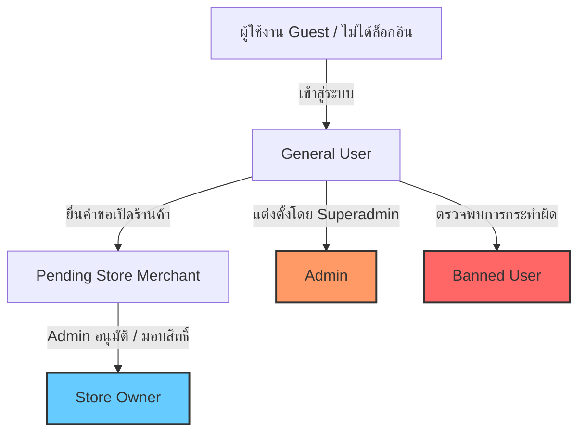

# 📦 เอกสารส่งมอบโปรเจกต์ (Project Handover Documentation)
**ชื่อโครงการ:** Clippi Travel / Ekitag Web (Heritage Tourism & Digital Stamp Rally System)  
**เวอร์ชัน:** 1.0.0-production-ready  
**ภาษาของเอกสาร:** ภาษาไทย (Thai)  
**วันที่ส่งมอบ:** ตุลาคม 2026  

---

## 📑 สารบัญ (Table of Contents)
1. [ภาพรวมโครงการ (Project Overview)](#1-ภาพรวมโครงการ-project-overview)
2. [เทคโนโลยีและสถาปัตยกรรม (Tech Stack & Architecture)](#2-เทคโนโลยีและสถาปัตยกรรม-tech-stack--architecture)
3. [โครงสร้างไดเรกทอรี (Project Directory Structure)](#3-โครงสร้างไดเรกทอรี-project-directory-structure)
4. [การติดตั้งและเริ่มต้นใช้งาน (Getting Started & Setup)](#4-การติดตั้งและเริ่มต้นใช้งาน-getting-started--setup)
5. [การกำหนดค่าตัวแปรระบบ (Environment Variables)](#5-การกำหนดค่าตัวแปรระบบ-environment-variables)
6. [ฐานข้อมูล นโยบายความปลอดภัย และ SQL (Database & Security)](#6-ฐานข้อมูล-นโยบายความปลอดภัย-และ-sql-database--security)
7. [ระบบสิทธิ์ผู้ใช้งาน (User Roles & Access Control)](#7-ระบบสิทธิ์ผู้ใช้งาน-user-roles--access-control)
8. [ฟังก์ชันการทำงานหลัก (Core Features & Business Logic)](#8-ฟังก์ชันการทำงานหลัก-core-features--business-logic)
9. [การรองรับแอพมือถือ (Mobile Support with Capacitor)](#9-การรองรับแอพมือถือ-mobile-support-with-capacitor)
10. [การ Build และ Deployment (Build & Deployment Guide)](#10-การ-build-และ-deployment-build--deployment-guide)
11. [ปัญหาที่พบบ่อยและข้อควรระวัง (Troubleshooting & Caveats)](#11-ปัญหาที่พบบ่อยและข้อควรระวัง-troubleshooting--caveats)
12. [แผนการพัฒนาต่อยอด (Future Roadmap & Recommendations)](#12-แผนการพัฒนาต่อยอด-future-roadmap--recommendations)

---

## 1. ภาพรวมโครงการ (Project Overview)

**Clippi Travel / Ekitag Web** คือเว็บแอปพลิเคชันและโมบายล์แอปสำหรับการท่องเที่ยวเชิงวัฒนธรรมและประวัติศาสตร์ (Heritage Tourism) โดยได้แรงบันดาลใจจากวัฒนธรรมการสะสมแสตมป์ตามสถานีและร้านค้าเก่าแก่ในประเทศญี่ปุ่น (Ekitag & Eki Stamp Rally)

### จุดเด่นของระบบ:
- **สำรวจและค้นหาสถานที่ประวัติศาสตร์ (Century-Old Shops & Heritage Spots):** รวบรวมข้อมูลร้านค้าและแลนด์มาร์กที่มีประวัติศาสตร์ยาวนาน
- **ระบบสะสมแสตมป์ดิจิทัล (Digital Stamp Collection):** สแกน QR Code ณ สถานที่จริง ตรวจสอบระยะทาง GPS Geofence (200m) และบันทึกแสตมป์พร้อมตราประทับหมึกแบบ SVG เสมือนจริง
- **เกมสะสมจิ๊กซอว์ภารกิจ (Jigsaw Quest Rally):** เดินทางสะสมชิ้นส่วนตาม Checkpoints เพื่อต่อภาพปริศนาและปลดล็อกของรางวัล
- **ระบบหลายบทบาท (Multi-role Support):** 
  - **User (นักท่องเที่ยว):** สำรวจ แผนที่ สแกน รีวิว สะสมแสตมป์ เสนอสถานที่
  - **Store Owner (เจ้าของร้าน):** ปรับแต่งตราประทับ (Stamp Designer), ตั้งกฎการสแกน (Cooldown/Time Window), จัดการข้อมูลร้าน
  - **Admin (ผู้ดูแลระบบ):** อนุมัติสถานที่, บริหารจัดการผู้ใช้และสิทธิ์, แบน/ปลดแบน, จัดการแบนเนอร์/ประกาศ, ตรวจสอบ Audit Log
- **รองรับ 3 ภาษา (i18n):** ภาษาไทย (TH), ภาษาอังกฤษ (EN), ภาษาญี่ปุ่น (JA)

---

## 2. เทคโนโลยีและสถาปัตยกรรม (Tech Stack & Architecture)

### 2.1 ฝั่ง Frontend
- **Framework & Core:** React 19 + TypeScript + Vite 8
- **Styling:** Tailwind CSS 4 + Lucide React Icons + Modern Glassmorphism & Micro-animations
- **Interactive Map:** Leaflet.js + `@types/leaflet` + OpenStreetMap Tiles
- **QR Scanning & Camera:** `jsQR` (ประมวลผล Canvas สแกนจากกล้องสดและรูปภาพ)
- **Internationalization (i18n):** `i18next` + `react-i18next` + `i18next-browser-languagedetector`
- **Mobile Container:** `@capacitor/core`, `@capacitor/cli`, `@capacitor/ios` (รองรับ PWA & Native App)

### 2.2 ฝั่ง Backend & Database (BaaS)
- **Platform:** Supabase (Managed PostgreSQL)
- **Authentication:** Supabase Auth (Email/Password, Magic Link, OTP, Session Persistence)
- **Storage Buckets:** Supabase Storage (เก็บรูปสถานที่, ตราประทับ, หลักฐานการเป็นเจ้าของ, แบนเนอร์, จิ๊กซอว์)
- **Realtime:** Supabase Realtime (ซิงก์การตั้งค่า QR Dynamic, ประกาศ, สถิติ)
- **Security:** PostgreSQL Row Level Security (RLS) + Database Functions (PL/pgSQL RPCs) + Triggers

---

## 3. โครงสร้างไดเรกทอรี (Project Directory Structure)

```plaintext
travel/
├── .env                              # ตัวแปรระบบ Supabase Credentials
├── index.html                        # HTML Entry point
├── package.json                      # รายการ Dependencies & Scripts
├── vite.config.ts                    # Vite Configuration
├── tsconfig.json                     # TypeScript Configuration
├── capacitor.config.ts               # Capacitor Mobile App Config
├── dist/                             # Output Production Build
├── public/                           # Static Assets (Images, Mascots, Logos)
├── docs/                             # เอกสารเพิ่มเติม (Sequence Diagrams, OTP Templates)
├── supabase/
│   ├── migrations/                   # SQL Migrations และ Backup Functions/Triggers
│   └── schema-backup/                # Schema Backups
└── src/
    ├── main.tsx                      # App bootstrap & Context Providers
    ├── App.tsx                       # Main Router, Navigation Shell, Modals Coordinator
    ├── supabaseClient.ts             # Supabase Client Initialization
    ├── index.css                     # Design System & Tailwind CSS Directives
    ├── assets/                       # Image assets, SVG seals
    ├── constants/
    │   └── mockData.ts               # Mock data, Default coordinates, System constants
    ├── context/
    │   └── ReviewStampContext.tsx    # Global Context สำหรับรีวิวและแสตมป์
    ├── hooks/
    │   ├── useUserRole.ts            # Hook ตรวจสอบสิทธิ์ (Admin / Store Owner / User / Banned)
    │   ├── useReviewStamp.ts         # Hook ดึงและจัดการ Reviews / Stamps / Places
    │   └── useJigsawQuests.ts        # Hook โหลดและบันทึกความคืบหน้าเควสจิ๊กซอว์
    ├── lib/
    │   ├── i18n.tsx                  # ระบบแปลภาษา 3 ภาษา (TH, EN, JA) + Language Switcher
    │   ├── geoHelpers.ts             # คำนวณระยะทาง Haversine & Geofence Validation
    │   ├── stampHelpers.ts           # แปลงและคำนวณ SVG Stamp, Ink Bleed, Stamp Versions
    │   ├── qrSettingsHelpers.ts      # จัดการ Dynamic QR, Cooldown, Realtime Subscription
    │   ├── activityHelpers.ts        # บันทึกและจัดรูปแบบ Admin Audit Logs & Activity Feed
    │   ├── bannerHelpers.ts          # CRUD และจัดอันดับการแสดงผลแบนเนอร์หน้าแรก
    │   ├── announcementHelpers.ts    # Broadcast ประกาศระบบ และ Notification Bell
    │   ├── ruleHelpers.ts            # กฎระเบียบร้านค้า เงื่อนไขการสแกนแสตมป์
    │   ├── scheduleHelpers.ts        # ตรวจสอบเวลาทำการและช่วงเวลาเปิดให้สแกน
    │   ├── passwordValidation.ts     # ตรวจสอบความปลอดภัยของรหัสผ่าน
    │   └── setup.sql                 # Consolidated Schema Script หลัก
    ├── components/
    │   ├── AchievementCelebration.tsx# เอฟเฟกต์ปลดล็อกรางวัลและเลเวลอัป
    │   ├── ActivityFeedModal.tsx     # ฟีดกิจกรรมผู้ใช้ล่าสุด
    │   ├── AdminAnnouncementModal.tsx# Modal ยิงประกาศระบบ (Admin)
    │   ├── CampaignBanner.tsx        # แบนเนอร์แคมเปญสไลด์หน้าแรก
    │   ├── Carousel.tsx              # สไลเดอร์แสดงรูปภาพและแบนเนอร์
    │   ├── ClippiMascot.tsx          # มาสคอต Clippi ประจำแอป
    │   ├── MerchantRegisterModal.tsx # ฟอร์มสมัครเป็นเจ้าของร้านค้า (Store Owner)
    │   ├── Modals.tsx                # PlaceDetailModal, AddPlaceModal, AdminSummaryModal
    │   ├── NewStamps.tsx             # วิดเจ็ตแสดงแสตมป์ใหม่ล่าสุด
    │   ├── NotificationBell.tsx      # กระดิ่งแจ้งเตือน Realtime พร้อมตัวนับ Unread
    │   ├── PlaceCard.tsx             # การ์ดสถานที่ (Full size & Compact)
    │   ├── RegionalBanners.tsx       # แบนเนอร์สำรวจตามภูมิภาคในญี่ปุ่น
    │   ├── SeasonalHits.tsx          # สถานที่ยอดนิยมตามฤดูกาล
    │   ├── ShopVersionHistoryModal.tsx# ตรวจสอบประวัติการแก้ไขข้อมูลร้าน
    │   ├── ShopVersionManagerModal.tsx# ระบบ Draft / Publish ข้อมูลร้านค้า
    │   ├── Sidebar.tsx               # Navigation Sidebar สำหรับจอ Desktop
    │   ├── StampDesignerModal.tsx    # เครื่องมือออกแบบตราประทับแสตมป์ (SVG Designer)
    │   ├── StampSealRenderer.tsx     # เรนเดอร์ตราประทับดิจิทัลพร้อมเอฟเฟกต์หมึกจริง
    │   ├── StarRow.tsx               # ดาวคะแนนรีวิว 1-5 ดาว
    │   ├── StoreRulesModal.tsx       # ตั้งค่ากฎร้านค้า (Cooldown & Time Window)
    │   ├── TrendingSpots.tsx         # จุดท่องเที่ยวยอดนิยมประจำสัปดาห์
    │   ├── auth/
    │   │   ├── BannedGuard.tsx       # ป้องกันและแจ้งเตือนผู้ใช้ที่ถูกแบน
    │   │   └── ProtectedRoute.tsx    # ควบคุมการเข้าถึงหน้า Admin / Store Owner
    │   ├── jigsaw/
    │   │   └── JigsawBoardView.tsx   # กระดานต่อจิ๊กซอว์และแสดงชิ้นส่วนที่ปลดล็อก
    │   ├── scanner/
    │   │   └── QRScannerModal.tsx    # หน้าจอสแกน QR Code + Geofence + Dynamic Token
    │   └── views/
    │       ├── ExploreView.tsx       # หน้าแรก: สำรวจสถานที่ แบนเนอร์ และแสตมป์ใหม่
    │       ├── TrendingAllView.tsx   # รายการสถานที่ยอดนิยมทั้งหมด
    │       ├── MapView.tsx           # หน้าแผนที่ Interactive Map พร้อมตัวกรองพิกัด
    │       ├── CollectionView.tsx    # หน้ารวมสมุดแสตมป์ที่สะสมแล้ว (Stamp Book)
    │       ├── ProfileView.tsx       # ข้อมูลส่วนตัว, สถิติ, ประวัติ และการตั้งค่า
    │       ├── AuthView.tsx          # เข้าสู่ระบบ / ลงทะเบียน / ลืมรหัสผ่าน
    │       ├── ManageShopsPage.tsx   # Admin: บริหารจัดการร้านค้าทั้งหมดในระบบ
    │       ├── UserManagementPage.tsx# Admin: จัดการผู้ใช้ มอบสิทธิ์ร้าน แบนบัญชี
    │       ├── AdminReviewView.tsx   # Admin: ตรวจสอบและอนุมัติสถานที่ที่ผู้ใช้ส่งเข้ามา
    │       ├── AdminLogPage.tsx      # Admin: ดู Audit Trail ประวัติการทำงานระบบ
    │       ├── AdminBannerManagePage.tsx # Admin: จัดการแบนเนอร์หน้าแรก
    │       ├── AdminJigsawManagePage.tsx # Admin: สร้างและจัดการเควสจิ๊กซอว์
    │       └── AchievementManagePage.tsx # Admin: จัดการระบบเหรียญรางวัลและความสำเร็จ
    └── pages/
        └── store/
            └── StoreManagementPage.tsx # หน้าแดชบอร์ดบริหารร้านค้าสำหรับ Store Owner
```

---

## 4. การติดตั้งและเริ่มต้นใช้งาน (Getting Started & Setup)

### 4.1 ความต้องการของระบบ (Prerequisites)
- **Node.js:** v18.0.0 หรือใหม่กว่า (แนะนำ Node.js LTS 20+)
- **NPM:** v9.0.0 หรือใหม่กว่า
- **Supabase Account & Project:** สำหรับฐานข้อมูลและ Authentication

### 4.2 ขั้นตอนการติดตั้ง (Installation Steps)

1. **Clone repository และเข้าสู่โฟลเดอร์โปรเจกต์:**
   ```bash
   git clone <repository-url>
   cd travel
   ```

2. **ติดตั้ง Dependencies:**
   ```bash
   npm install
   ```

3. **สร้างไฟล์ `.env` สำหรับตั้งค่าตัวแปรระบบ:**
   คัดลอกไฟล์ `.env` ตัวอย่างและกรอกคีย์ Supabase:
   ```bash
   cp .env.example .env
   ```

4. **รัน Development Server:**
   ```bash
   npm run dev
   ```
   ระบบจะเปิด Local Server ที่พอร์ต `http://localhost:5173`

5. **ตรวจสอบ Type และ Linting:**
   ```bash
   npm run lint
   ```

6. **ทดสอบการ Build สำหรับ Production:**
   ```bash
   npm run build
   ```

---

## 5. การกำหนดค่าตัวแปรระบบ (Environment Variables)

ไฟล์ `.env` อยู่ที่ Root Directory ต้องมีตัวแปรหลักดังนี้:

```env
# URL ของ Supabase Project
VITE_SUPABASE_URL=https://your-project-id.supabase.co

# Supabase Anon Public Key (สำหรับเชื่อมต่อ Frontend)
VITE_SUPABASE_ANON_KEY=eyJhbGciOiJIUzI1NiIsInR5cCI6IkpXVCJ9...
```

> ⚠️ **หมายเหตุสำคัญด้านความปลอดภัย:**
> ห้ามใส่ `SUPABASE_SERVICE_ROLE_KEY` ในโค้ด Frontend หรือไฟล์ `.env` ฝั่ง Client เด็ดขาด เพราะ Service Key มีสิทธิ์ Bypass RLS ทั้งหมด

---

## 6. ฐานข้อมูล นโยบายความปลอดภัย และ SQL (Database & Security)

ระบบใช้ฐานข้อมูล PostgreSQL บน Supabase โครงสร้างตารางและสคริปต์ SQL หลักมีดังนี้:

### 6.1 ตารางหลักในระบบ (Main Tables)

| ตาราง (Table Name) | หน้าที่และความสัมพันธ์ (Description & Relations) |
| :--- | :--- |
| `century_shops` | สถานที่/ร้านค้าประวัติศาสตร์หลัก (พิกัด, ชื่อ, ปีที่ก่อตั้ง, คะแนน, `owner_id`, `stamp_versions`) |
| `place_submissions` | คำขอเพิ่มสถานที่ใหม่ที่ผู้ใช้เสนอเข้ามา รอ Admin อนุมัติ (`pending`, `approved`, `rejected`) |
| `user_stamps` | บันทึกการสะสมแสตมป์ของผู้ใช้งาน (`user_id`, `shop_id`, `collected_at`, `stamp_version_id`) |
| `reviews` | รีวิวและความคิดเห็นสถานที่ (`user_id`, `place_id`, `rating 1-5`, `comment`) |
| `profiles` | ข้อมูลโปรไฟล์ผู้ใช้ (`display_name`, `avatar_url`, `role`, `is_banned`, `ban_reason`, `merchant_status`) |
| `user_roles` | ตารางคู่ขนานสำหรับจัดการสิทธิ์ (`user_id`, `role: 'admin' \| 'store' \| 'user'`) |
| `admin_action_log` | บันทึก Audit Trail ทุกการกระทำของ Admin (อนุมัติ, ปฏิเสธ, มอบสิทธิ์, แก้ไขร้านค้า) |
| `jigsaw_quests` | เควสจิ๊กซอว์ภารกิจ (`id`, `title`, `reward_code`, `full_image_url`, `grid_rows`, `grid_cols`) |
| `jigsaw_pieces` | ชิ้นส่วนจิ๊กซอว์แต่ละจุดพิกัด (`quest_id`, `piece_index`, `qr_code_value`, `target_lat`, `target_lng`) |
| `user_jigsaw_pieces`| บันทึกชิ้นส่วนจิ๊กซอว์ที่ผู้ใช้เก็บได้แล้ว |
| `app_banners` | ข้อมูลแบนเนอร์ประชาสัมพันธ์หน้าแรก (ลำดับ, รูปภาพ, ปุ่ม CTA, วันที่เริ่มต้น/สิ้นสุด) |
| `system_announcements` | ประกาศระบบแจ้งเตือนผู้ใช้งานทุกคน |
| `announcement_reads` | บันทึกสถานะการเปิดอ่านประกาศของผู้ใช้แต่ละคน |
| `merchant_events` | กิจกรรมโปรโมชั่นที่เจ้าของร้านค้าสร้างขึ้น |
| `achievements` | รายการเหรียญตราความสำเร็จและเงื่อนไขการปลดล็อก |

### 6.2 การรันสคริปต์ SQL (SQL Setup & Migrations)
สคริปต์ SQL สำหรับสร้างตาราง, ฟังก์ชัน และ RLS อยู่ในโฟลเดอร์ [`src/lib/`](file:///c:/Users/USER/travel/src/lib/) และ [`supabase/migrations/`](file:///c:/Users/USER/travel/supabase/migrations/):
1. **Schema & Tables:** รัน [`src/lib/setup.sql`](file:///c:/Users/USER/travel/src/lib/setup.sql)
2. **Jigsaw Quests:** รัน [`src/lib/jigsaw_setup.sql`](file:///c:/Users/USER/travel/src/lib/jigsaw_setup.sql)
3. **Banners System:** รัน [`src/lib/banners_setup.sql`](file:///c:/Users/USER/travel/src/lib/banners_setup.sql)
4. **Seed ข้อมูลร้านค้าญี่ปุ่น:** รัน [`src/lib/import_century_shops.sql`](file:///c:/Users/USER/travel/src/lib/import_century_shops.sql) หรือ [`century_shops_rows.sql`](file:///c:/Users/USER/travel/century_shops_rows.sql)
5. **Update Coordinates:** รัน [`src/lib/update_century_shops_coordinates.sql`](file:///c:/Users/USER/travel/src/lib/update_century_shops_coordinates.sql)
6. **Stored Functions & Triggers Backup:** ดูเพิ่มเติมที่ [`supabase/migrations/functions_and_triggers_backup.sql`](file:///c:/Users/USER/travel/supabase/migrations/functions_and_triggers_backup.sql)

### 6.3 Storage Buckets ที่ต้องสร้างใน Supabase Dashboard
กรุณาสร้าง Storage Buckets ต่อไปนี้ใน Supabase Storage และตั้งค่า Public Access:
- `shop-images` - สำหรับรูปภาพหน้าร้านและบรรยากาศสถานที่
- `stamp-designs` - สำหรับรูปภาพตราประทับและไอคอนแสตมป์
- `merchant-proofs` - สำหรับเอกสารหลักฐานความเป็นเจ้าของร้าน (สิทธิ์ Restricted/Admin Read)
- `jigsaw-images` - สำหรับรูปภาพเต็มของเควสจิ๊กซอว์
- `banner-images` - สำหรับรูปภาพแบนเนอร์ประชาสัมพันธ์

---

## 7. ระบบสิทธิ์ผู้ใช้งาน (User Roles & Access Control)

ระบบใช้สถาปัตยกรรมแบบ **Hierarchical Role & Permission Guard** ควบคุมผ่าน [`src/hooks/useUserRole.ts`](file:///c:/Users/USER/travel/src/hooks/useUserRole.ts) และ [`src/components/auth/ProtectedRoute.tsx`](file:///c:/Users/USER/travel/src/components/auth/ProtectedRoute.tsx)



### รายละเอียดแต่ละบทบาท:
1. **General User (`user`):**
   - ใช้งานหน้า Explore, Map, Collection, Profile
   - สแกน QR Code รับแสตมป์ (ต้องผ่านเงื่อนไข Geofence 200m และ Cooldown)
   - เขียนรีวิว ให้คะแนน 1-5 ดาว
   - ยื่นคำขอเพิ่มสถานที่ใหม่ (`place_submissions`)
   - สมัครเป็นเจ้าของร้านค้า (`MerchantRegisterModal`)

2. **Store Owner (`store`):**
   - ได้รับสิทธิ์ทั้งหมดของ User
   - เข้าถึงหน้า [`StoreManagementPage`](file:///c:/Users/USER/travel/src/pages/store/StoreManagementPage.tsx) สำหรับร้านค้าที่ `century_shops.owner_id == auth.uid()`
   - ออกแบบและแก้ไขตราประทับร้านค้าผ่าน [`StampDesignerModal`](file:///c:/Users/USER/travel/src/components/StampDesignerModal.tsx)
   - จัดการกฎการสแกน Cooldown และเปิด/ปิด Dynamic QR ผ่าน [`StoreRulesModal`](file:///c:/Users/USER/travel/src/components/StoreRulesModal.tsx)
   - จัดการเวอร์ชัน Draft และ Publish ข้อมูลร้าน

3. **Administrator (`admin`):**
   - สิทธิ์สูงสุดของระบบ เข้าถึงเมนู Admin ทั้งหมด
   - **Review Submissions:** อนุมัติ/ปฏิเสธสถานที่ที่ผู้ใช้ส่งเข้ามา
   - **User Management:** มอบสิทธิ์ร้านค้า (`assign_store_owner` RPC), ระงับบัญชี (Ban) พร้อมระบุเหตุผล
   - **Shop Management:** เพิ่ม/ลบ/แก้ไขร้านค้าทั้งหมดในระบบ
   - **Banner & Announcement:** ยิงประกาศระบบ และเปลี่ยนแบนเนอร์หน้าแรก
   - **Jigsaw & Achievements:** สร้างเควสสะสมจิ๊กซอว์และจัดการเหรียญรางวัล
   - **Audit Logs:** ตรวจสอบประวัติการทำงานของแอดมินทุกคน

4. **Banned User:**
   - ถูกควบคุมโดย [`BannedGuard`](file:///c:/Users/USER/travel/src/components/auth/BannedGuard.tsx)
   - ล็อกหน้าจอทันที แสดงเหตุผลการแบนและปุ่มติดต่อฝ่ายสนับสนุน

---

## 8. ฟังก์ชันการทำงานหลัก (Core Features & Business Logic)

### 8.1 ระบบ Geofence และการสแกน QR Code (200-Meter Geofence)
- **ไฟล์สำคัญ:** [`src/components/scanner/QRScannerModal.tsx`](file:///c:/Users/USER/travel/src/components/scanner/QRScannerModal.tsx), [`src/lib/geoHelpers.ts`](file:///c:/Users/USER/travel/src/lib/geoHelpers.ts)
- **กระบวนการ:**
  1. เมื่อผู้ใช้สแกน QR Code ระบบจะถอดรหัส `shop_id` หรือ `jigsaw_piece_id`
  2. ดึงพิกัด GPS ปัจจุบันของผู้ใช้ผ่าน `navigator.geolocation.getCurrentPosition`
  3. คำนวณระยะห่างระหว่างผู้ใช้กับสถานที่เป้าหมายด้วยสูตร Haversine
  4. หากระยะห่าง **<= 200 เมตร** (`GEOFENCE_RADIUS_METERS = 200`) และผ่านเงื่อนไข Cooldown ระบบจะบันทึกแสตมป์ลง `user_stamps`
  5. มีระบบ Bypass สำหรับ Admin หรือโหมดทดสอบเมื่อตั้งค่าอนุญาต

### 8.2 การเรนเดอร์ตราประทับดิจิทัล (Dynamic Stamp & Ink Engine)
- **ไฟล์สำคัญ:** [`src/components/StampSealRenderer.tsx`](file:///c:/Users/USER/travel/src/components/StampSealRenderer.tsx), [`src/lib/stampHelpers.ts`](file:///c:/Users/USER/travel/src/lib/stampHelpers.ts)
- **คุณสมบัติ:**
  - สร้างตราประทับทรงกลม ทรงกลีบดอกซากุระ หรือทรงเหลี่ยมตามวัฒนธรรมญี่ปุ่น
  - ใส่เอฟเฟกต์ Ink Bleed (หมึกซึม), ความโปร่งแสง และรอยประทับหมึกแดง/น้ำเงิน/ม่วงแบบดั้งเดิม
  - รองรับข้อความภาษาญี่ปุ่นและปีที่ก่อตั้งแบบวงแหวนรอบตราประทับ

### 8.3 ระบบ Audit Trail และความโปร่งใสของ Admin
- **ไฟล์สำคัญ:** [`src/components/views/AdminLogPage.tsx`](file:///c:/Users/USER/travel/src/components/views/AdminLogPage.tsx), [`src/lib/activityHelpers.ts`](file:///c:/Users/USER/travel/src/lib/activityHelpers.ts)
- **โครงสร้างข้อมูล:**
  - ตาราง `admin_action_log` บันทึก `admin_id`, `action_type`, `target_id`, `details (JSONB)`, `created_at`
  - Action Types: `approve_submission`, `reject_submission`, `auto_approve_own_submission`, `assign_store_owner`, `update_shop`, `delete_shop`, `ban_user`, `unban_user`

### 8.4 ระบบหลายภาษา (Internationalization - i18n)
- **ไฟล์สำคัญ:** [`src/lib/i18n.tsx`](file:///c:/Users/USER/travel/src/lib/i18n.tsx)
- **การใช้งาน:**
  - ใช้ Hook `const { t, lang, setLang } = useLang();`
  - คีย์การแปลครอบคลุมทั้ง 3 ภาษา (TH, EN, JA) มากกว่า 400+ คีย์คำศัพท์

---

## 9. การรองรับแอพมือถือ (Mobile Support with Capacitor)

โปรเจกต์รองรับการแปลงเป็นโมบายล์แอป Native (iOS / Android) ผ่าน **Capacitor**:

### คำสั่งสำหรับจัดการ Mobile Build:
```bash
# 1. Build โค้ด Web เป็น Production
npm run build

# 2. ซิงก์ไฟล์ Bundle ไปยัง Native Platform
npx cap sync

# 3. เปิดโปรเจกต์ iOS ใน Xcode (บน macOS)
npx cap open ios

# 4. เพิ่ม Android Platform (หากต้องการ)
npx cap add android
npx cap open android
```

---

## 10. การ Build และ Deployment (Build & Deployment Guide)

### 10.1 คำสั่งสำคัญใน `package.json`
| คำสั่ง (Command) | การทำงาน (Action) |
| :--- | :--- |
| `npm run dev` | รัน Local Vite Dev Server |
| `npm run build` | รัน TypeScript Typecheck (`tsc -b`) และ Build Bundle ด้วย Vite ลงโฟลเดอร์ `dist/` |
| `npm run lint` | ตรวจสอบ Code Quality ด้วย `oxlint` (เร็วพิเศษ) |
| `npm run preview` | ทดสอบรัน Production Bundle ใน Local เพื่อตรวจเช็กความถูกต้องก่อน Deploy จริง |

### 10.2 การ Deploy ไปยัง Vercel / Netlify / Cloudflare Pages
1. เชื่อมต่อ Git Repository กับ Hosting Platform (เช่น Vercel หรือ Netlify)
2. ตั้งค่า Build Settings:
   - **Framework Preset:** Vite
   - **Build Command:** `npm run build`
   - **Output Directory:** `dist`
3. ตั้งค่า **Environment Variables** ใน Dashboard:
   - `VITE_SUPABASE_URL`
   - `VITE_SUPABASE_ANON_KEY`
4. ตั้งค่า Single Page Application (SPA) Rewrite Rule ใน `vercel.json` หรือ `_redirects` เพื่อให้ Routing ของ React ทำงานถูกต้องเมื่อ Refresh หน้า

---

## 11. ปัญหาที่พบบ่อยและข้อควรระวัง (Troubleshooting & Caveats)

### 1. ปัญหาพิกัด GPS / Geofence ไม่ทำงาน
- **สาเหตุ:** เบราว์เซอร์ปฏิเสธสิทธิ์การเข้าถึง Location หรือไม่ได้ใช้งานผ่านโปรโตคอล `HTTPS` (เบราว์เซอร์ยุคใหม่จะบล็อก Geolocation API บน HTTP ธรรมดา ยกเว้น localhost)
- **วิธีแก้:** ต้องแน่ใจว่าเปิดใช้งาน HTTPS เสมอ และผู้ใช้กด Allow สิทธิ์ตำแหน่งในเบราว์เซอร์

### 2. ปัญหาภาพไม่แสดงผลในบางการ์ด
- **สาเหตุ:** URL รูปภาพภายนอกติด CORS หรือเป็น Hotlink ที่หมดอายุ
- **วิธีแก้:** อัปโหลดรูปภาพเข้า Supabase Storage Bucket (`shop-images`) และใช้ Public CDN URL

### 3. การมอบสิทธิ์ร้านค้า (`owner_id`) ไม่ติด
- **สาเหตุ:** RLS นโยบายของ `century_shops` ป้องกันไม่ให้ User ทั่วไปแก้ไข
- **วิธีแก้:** ให้ Admin ดำเนินการผ่านหน้าระบบ [`UserManagementPage`](file:///c:/Users/USER/travel/src/components/views/UserManagementPage.tsx) ซึ่งเรียกใช้ RPC Function ที่มีสิทธิ์ `SECURITY DEFINER`

### 4. ผู้ใช้ถูกแบนแล้วยังสามารถเรียก API ได้
- **สาเหตุ:** Token ของผู้ใช้ยังไม่หมดอายุ
- **วิธีแก้:** ระบบมี `BannedGuard` ที่ฝั่ง Client และมีนโยบาย RLS ที่ตรวจสอบ `profiles.is_banned = false` ทุกครั้งที่มีการ Read/Write

---

## 12. แผนการพัฒนาต่อยอด (Future Roadmap & Recommendations)

1. **Push Notifications (ระบบแจ้งเตือนแบบพุช):**
   - รวมระบบ Firebase Cloud Messaging (FCM) หรือ OneSignal เพื่อแจ้งเตือนเมื่อมีเควสใหม่ หรือเมื่อผู้ใช้เดินเข้าใกล้ร้านค้าในรัศมี
2. **Offline Mode & PWA Caching:**
   - พัฒนา Service Worker ให้รองรับการเปิดสมุดแสตมป์ (`CollectionView`) ขณะไม่มีสัญญาณอินเทอร์เน็ต
3. **Social Sharing & Sticker Cam:**
   - เพิ่มฟีเจอร์ถ่ายรูปคู่กับตราประทับแสตมป์แบบ AR / Photo Overlay เพื่อแชร์ลง Instagram / Facebook Stories
4. **Automated Unit & E2E Testing:**
   - เพิ่มการทดสอบอัตโนมัติด้วย Vitest และ Playwright สำหรับกระบวนการสแกนและ Flow การอนุมัติสถานที่

---

## 📞 ช่องทางการติดต่อและข้อมูลทีมพัฒนาเดิม
- **Repository:** `travel / clippi-travel`
- **สถานะ:** พร้อมส่งมอบงานและพัฒนาต่อยอดได้ทันที
