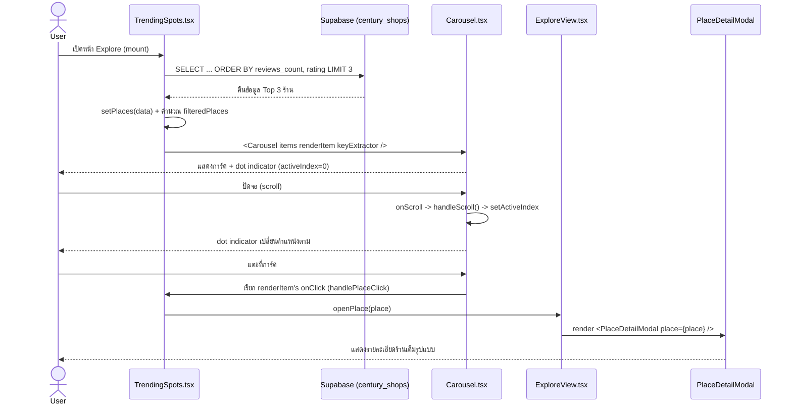

# Carousel Component — End-to-End Sequence Diagram

อธิบาย flow การทำงานของ Carousel.tsx (T16) ที่ TrendingSpots.tsx (T17) เรียกใช้ ตั้งแต่โหลดข้อมูลจนถึงเปิดหน้ารายละเอียดร้าน

## หมายเหตุสถาปัตยกรรม

- **Carousel.tsx** ไม่รู้จัก "สถานที่" หรือ "ร้าน" เลย — รับแค่ `items` ทั่วไปและฟังก์ชัน `renderItem` ทำให้ใช้ซ้ำกับ Banner (T06), Seasonal Hits (T04/T05/T07), New Stamps (T19) ได้โดยไม่ต้องแก้ Carousel.tsx เอง
- **การนำทางไปหน้ารายละเอียด** ไหลผ่าน prop `openPlace` ที่ส่งต่อกันจาก App.tsx -> ExploreView.tsx -> TrendingSpots.tsx (prop drilling แบบง่าย เพราะแอปนี้ไม่มีระบบ Routing)
